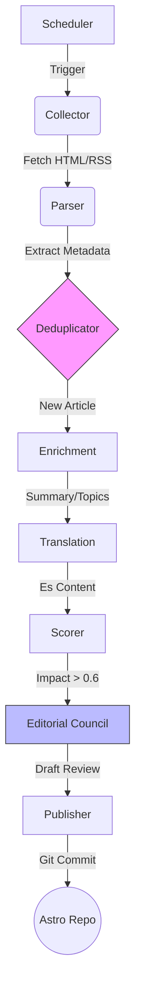

# AGENTS.md — Noticiencias Backend (News Collector)

> **Audience:** Data Engineers, AI Agents, and Bot Operators.
> **Purpose:** The "Constitution" of the ingestion engine. Defines the lawful flow of data from chaos (web) to order (Astro content).

---

## 0) Architecture Snapshot (v2.0)

Logical data flow:



---

## 1) Core Entities & Contracts

### 1.1 The Article Model

Strictly typed via `news_collector.contracts.collector.CollectorArticleModel`.

| Field          | Type         | Constraint                                   |
| :------------- | :----------- | :------------------------------------------- |
| `url`          | `AnyHttpUrl` | Primary distinct key (after normalization)   |
| `original_url` | `str`        | Must match `http(s)://`                      |
| `title`        | `str`        | Min length: 10 chars                         |
| `content`      | `str`        | Min length: 50 chars (combined with summary) |
| `source_id`    | `str`        | Must coincide with `config.sources` key      |
| `language`     | `str`        | ISO 639-1 (en, es). Defaults to 'en'.        |
| `authors`      | `List[str]`  | Normalized. No "admin", "staff".             |

### 1.2 Event Envelope

All inter-agent messages must be wrapped:

```json
{
  "event_id": "uuid",
  "stage": "enrichment.translation",
  "payload": { ...ArticleModel... },
  "trace_id": "uuid",
  "timestamp": "ISO-8601 UTC"
}
```

---

## 2) Agent Roles

| Agent         | Module                 | Responsibility              | Guardrails                                         |
| :------------ | :--------------------- | :-------------------------- | :------------------------------------------------- |
| **Collector** | `collectors/`          | I/O with the outside world. | Rate Limits, Robot.txt, User-Agent.                |
| **Parser**    | `collectors/parsers`   | Data Extraction.            | No "Untitled". Clean UTF-8.                        |
| **Enricher**  | `enrichment/nlp_stack` | Summarization, Translation. | **Dedupe First**. No translation of duplicates.    |
| **Scorer**    | `scoring/`             | Value Judgment.             | 0.0-1.0 range. >0.8 requires DOI/Academic Source.  |
| **Editor**    | `editorial/council`    | Quality Assurance.          | Tone check. No "AI hallucinations" in translation. |
| **Publisher** | `serving/`             | Output Generation.          | Clean Markdown. Valid Frontmatter.                 |

---

## 3) Regression Guardrails (RG)

### RG1: Efficiency First (Deduplication)

- **Rule:** Expensive operations (LLM Translation, Scoring) MUST ONLY occur after deduplication.
- **Implementation:** `utils.dedupe` checks `original_url` and Title Similarity (>0.9) before Enrichment stage.

### RG2: Scientific Credibility

- **Rule:** An article cannot be scored "High Impact" (>0.8) purely on sentiment.
- **Requirement:** Must contain specific keywords (DOI, Journal Name, "Study", "Research") or come from a Trusted Source (NASA, MIT, specific Nature RSS).

### RG3: Ethical Scraping

- **Rule:** We are aggregators, not pirates.
- **Full Text:** Do NOT store full text of paywalled articles. Store only Summary/Abstract.
- **Attribution:** Every payload MUST have `original_url` and `source_name`.
- **Robots.txt:** Respect `Disallow` unless explicitly whitelisted in `RobotsConfig` (e.g. for APIs that behave like buckets).

### RG4: Reliability & Idempotency

- **Rule:** Running the pipeline twice on the same feed on the same day must yield the same result (or skip gracefully).
- **Mechanism:** Use Content Hashes for ID generation.

### RG5: Code Quality

- **Style:** `ruff` compliant.
- **Typing:** `mypy` strict mode for Contracts.
- **Logs:** Structured JSON logs for machine consumption, concise text for humans.

---

## 4) Operational Workflows

### W1: Adding a Source

1.  Add entry to `config/sources.py`.
2.  Run `scripts/verify_source.py --source <id>`.
3.  Check `data/exports/source_health.json` for success.

### W2: Fixing a Broken Parser

1.  Identify failure stage (Fetch vs Parse).
2.  Capture HTML dump from `temp/`.
3.  Create a test fixture in `tests/fixtures/`.
4.  Fix selector in `collectors/parsers/`.
5.  Run `pytest tests/unit/parsers/`.

### W3: Deployment

1.  `docker build` -> Tag with Git SHA.
2.  `docker run` with env vars for Secrets.

---

## 5) Change Governance

| Change Type                  | Agent Autonomy | Human Review?       |
| :--------------------------- | :------------- | :------------------ |
| **New Source Config**        | ✅ Allowed     | Recommended (Audit) |
| **Parser Selector Fix**      | ✅ Allowed     | No                  |
| **LLM Prompt Update**        | ❌ Forbidden   | **REQUIRED**        |
| **Scoring Logic**            | ❌ Forbidden   | **REQUIRED**        |
| **Dependency Major Upgrade** | ❌ Forbidden   | **REQUIRED**        |

---

**End of AGENTS.md**
