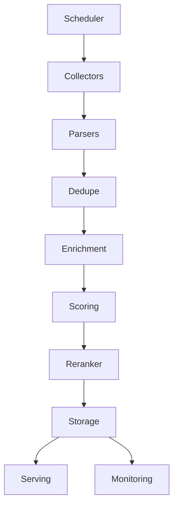

# Noticiencias News Collector

## What | ¿Qué
- **EN:** Automated ingestion, enrichment, scoring, and reranking of scientific news across premium sources, ready to serve downstream apps.
- **ES:** Ingesta, enriquecimiento, scoring y reordenamiento automático de noticias científicas de fuentes premium, listo para servir aplicaciones aguas abajo.

## Why | ¿Por qué
- **EN:** Keeps editorial and research teams focused on insights instead of feed maintenance, while enforcing auditability and diversity guardrails.
- **ES:** Mantiene a los equipos editoriales y de investigación enfocados en los hallazgos, con trazabilidad completa y barreras de diversidad.

## How | ¿Cómo
- **EN:** A scheduler triggers modular collectors → parsers → enrichment → scoring → reranker → storage, all observable via structured logging (`docs/collector_runbook.md`) and incident procedures (`docs/runbook.md`).
- **ES:** Un scheduler activa colectores modulares → parsers → enriquecimiento → scoring → reranker → almacenamiento, todo observable con logging estructurado (`docs/collector_runbook.md`) y procedimientos de incidentes (`docs/runbook.md`).

## Quickstart (≤3 commands) | Inicio rápido (≤3 comandos)
1. `make bootstrap` – provision dependencies with pinned hashes.
2. `make test` – run unit tests with coverage to validate the stack locally.
3. `make lint` – enforce Ruff linting before opening a pull request.

For a dry-run ingestion after setup, execute `python run_collector.py --dry-run`.

## Operate & Observe | Operar y observar
- **Structured logging:** follow field definitions and samples in [`docs/collector_runbook.md`](docs/collector_runbook.md).
- **Runbooks:** production triage flows live in [`docs/runbook.md`](docs/runbook.md); collector-specific procedures remain in [`docs/collector_runbook.md`](docs/collector_runbook.md).
- **Dashboards & alerts:** maintain Grafana panels for ingest lag, dedupe F1, and reranker freshness; alert thresholds match the values documented in `AGENTS.md`.

## Contracts & Schemas | Contratos y esquemas
- [`AGENTS.md` – Shared Contracts & Schemas](AGENTS.md#1-shared-contracts--schemas)
- [`docs/common_output_format.md`](docs/common_output_format.md) – canonical payload for downstream consumers.

## Additional References | Referencias adicionales
- [`docs/fixtures.md`](docs/fixtures.md) – fixture catalog and regeneration tips.
- [`docs/api_examples.md`](docs/api_examples.md) – example API consumers using the stored articles.
- [`AUDIT_PROMPTS.md`](AUDIT_PROMPTS.md) – prompts used during the latest system audit.
