# 🧬 News Collector System
_Plataforma modular para recolectar, enriquecer y priorizar noticias científicas con trazabilidad operativa completa._

[](.github/workflows/ci.yml)
[](https://www.python.org/downloads/)
[](CHANGELOG.md)

## Tabla de contenidos
1. [Descripción general](#descripción-general)
2. [Arquitectura / Flujo](#arquitectura--flujo)
3. [Instalación](#instalación)
4. [Configuración](#configuración)
5. [Uso](#uso)
6. [Scripts y evaluación offline](#scripts-y-evaluación-offline)
7. [Runbooks](#runbooks)
8. [Datos de entrada/salida](#datos-de-entrada-salida)
9. [Estructura del proyecto](#estructura-del-proyecto)
10. [Pruebas](#pruebas)
11. [CI/CD](#cicd)
12. [Performance y límites conocidos](#performance-y-límites-conocidos)
13. [Seguridad](#seguridad)
14. [Troubleshooting & FAQ](#troubleshooting--faq)
15. [Roadmap y limitaciones](#roadmap-y-limitaciones)
16. [Contribución](#contribución)
17. [Licencia y créditos](#licencia-y-créditos)
18. [Preguntas abiertas](#preguntas-abiertas)

## Descripción general
News Collector System automatiza la ingesta de fuentes científicas (journals, agencias, divulgadores), aplica limpieza y enriquecimiento lingüístico, calcula un puntaje multidimensional y genera listados priorizados para su publicación o consumo por APIs internas. Está pensado para equipos de datos/noticias que necesitan decisiones reproducibles, auditoría y herramientas de operación.

**Características clave**
- Catalogación de 15 fuentes curadas con metadatos de credibilidad y frecuencia.
- Pipelines determinísticos de deduplicación, enriquecimiento y scoring con explicación de cada feature.
- CLI central (`run_collector.py`) con modos de simulación, healthchecks y filtrado de fuentes.
- Herramientas de configuración (CLI y GUI) sobre un esquema validado por Pydantic.
- Instrumentación lista para monitoreo (logs estructurados, métricas y reportes).

## Arquitectura / Flujo

```mermaid
flowchart TD
    Scheduler[Programador / cron] --> Collectors[Collectors RSS]
    Collectors --> Parsers[Parser & Normalizador]
    Parsers --> Dedupe[Canonicalización & Dedupe]
    Dedupe --> Enrichment[Enriquecimiento NLP]
    Enrichment --> Scoring[Scoring & Explicabilidad]
    Scoring --> Reranker[Reranker & Diversidad]
    Reranker --> Storage["Persistencia (SQL, logs)"]
    Storage --> Serving[APIs / Reporting]
    Storage --> Monitoring[Monitoreo & Alertas]
```

Las interfaces entre etapas se documentan en [AGENTS.md](AGENTS.md), y los contratos formales viven en `src/contracts/`.

## Instalación
### Prerrequisitos
- Python 3.10 o superior (probado en 3.12).
- Git.
- (Opcional) Docker 24+ para empaquetar contenedores.

### Quickstart con Makefile
```bash
make bootstrap
make lint typecheck test
make security
.venv/bin/python run_collector.py --dry-run
```

- `make bootstrap`: crea el entorno virtual y sincroniza dependencias (incluye escáneres).
- `make lint typecheck test`: ejecuta Ruff, mypy y pytest con cobertura en un solo paso.
- `make security`: corre `pip-audit`, `bandit` y `trufflehog3`, dejando reportes en `reports/security/`.
- `.venv/bin/python run_collector.py --dry-run`: valida el pipeline completo sin escribir en almacenamiento.

### Estrategia de dependencias reproducibles
- **Fuente única:** `requirements.lock` (runtime) y `requirements-security.lock` (escáneres) concentran todas las versiones con hashes. `requirements.txt` solo documenta dependencias legibles; cualquier cambio requiere regenerar los lockfiles.
- **Actualización de locks:** ejecutar `pip-compile --generate-hashes --output-file=requirements.lock requirements.txt` y `pip-compile --allow-unsafe --extra=security --generate-hashes --output-file=requirements-security.lock pyproject.toml` desde un entorno limpio.
- **Verificación:** `make bootstrap` instala con `--require-hashes`, garantizando instalaciones deterministas. Dependabot está configurado en modo _lockfile-only_ para proponer parches sin romper los pines.

### Instalación manual con `venv`
```bash
python3 -m venv .venv
source .venv/bin/activate
python -m pip install --upgrade pip
pip install --require-hashes -r requirements.lock
pip install --require-hashes -r requirements-security.lock
```

### Otras utilidades de `make`
- `make lint` – Ejecuta `pre-commit run --all-files` (Ruff, Black, isort, mypy y checks básicos).
- `make lint-fix` / `make format` – Formato automático (Black + isort + Ruff `--fix`).
- `make fix-makefile-tabs` – Normaliza indentación en recetas de Makefile (tabs obligatorios).
- `make type` / `make typecheck` – mypy sobre los módulos tipados incrementalmente (`scripts/generate_api_docs.py`, `src/utils/logger.py`, `src/utils/url_canonicalizer.py`).
- `make docs` / `make docs-api` – Regenera la documentación de API con `pdoc`.
- `make security` – `pip-audit`, `bandit` y `trufflehog3` con `scripts/security_gate.py`.
- `make audit` – alias del objetivo anterior, usado en CI para auditorías de supply chain.
- `make audit-issues` – crea issues en GitHub a partir de `audit/*.md` (ver [docs/tools_audit_issues.md](docs/tools_audit_issues.md)).
- `make build` – genera un wheel reproducible en `dist/` usando pines.
- `make config-validate` / `make config-dump` / `make config-docs` – gestión de configuración.
- `make config-gui` – lanza el editor gráfico (requiere servidor X).
- `make clean` – elimina `.venv` y caches.

## Configuración
### Precedencia de capas
1. **Defaults** incluidos en `noticiencias.config_schema.DEFAULT_CONFIG`.
2. **Archivo TOML** (`config.toml`).
3. **Archivo `.env`** contiguo (`NOTICIENCIAS__…=valor`).
4. **Variables de entorno** con prefijo `NOTICIENCIAS__` (último gana).

Ejemplo de sobrescritura anidada:
```bash
export NOTICIENCIAS__DATABASE__DRIVER=postgresql
export NOTICIENCIAS__SCORING__MINIMUM_SCORE=0.45
export NOTICIENCIAS__COLLECTION__MAX_CONCURRENT_REQUESTS=16
```

Para inspeccionar la configuración activa:
```bash
.venv/bin/python -m noticiencias.config_manager --show-sources
.venv/bin/python -m noticiencias.config_manager --validate
.venv/bin/python -m noticiencias.config_manager --explain collection.request_timeout_seconds
```
Otros subcomandos disponibles: `--dump-defaults`, `--print-schema`, `--set clave=valor` (ver [docs/config_fields.md](docs/config_fields.md)).

### Variables críticas
| Nombre | Tipo | Default | Requerido | Descripción |
| --- | --- | --- | --- | --- |
| `collection.collection_interval_hours` | entero | 6 | Opcional | Horas entre recolecciones completas. |
| `collection.request_timeout_seconds` | entero | 30 | Opcional | Timeout de requests HTTP del colector. |
| `collection.async_enabled` | bool | `false` | Opcional | Activa colector asíncrono (`httpx.AsyncClient`). |
| `collection.max_concurrent_requests` | entero | 8 | Opcional | Máximo de requests paralelos cuando hay modo async. |
| `collection.max_articles_per_source` | entero | 50 | Opcional | Recorte de artículos por fuente en cada ciclo. |
| `collection.recent_days_threshold` | entero | 7 | Opcional | Días considerados "recientes" en enriquecimiento. |
| `collection.canonicalization_cache_size` | entero | 2048 | Opcional | Tamaño del LRU de URLs canonicalizadas (0 desactiva cache). |
| `collection.user_agent` | texto | `NoticienciasBot/1.0 (+https://noticiencias.com)` | Recomendado | User-Agent usado en requests HTTP. |
| `rate_limiting.delay_between_requests_seconds` | float | 1.0 | Opcional | Delay base entre requests a una fuente. |
| `rate_limiting.domain_default_delay_seconds` | float | 1.0 | Opcional | Delay fallback para dominios sin override. |
| `rate_limiting.domain_overrides` | tabla | ver `config.toml` | Opcional | Delays específicos por host (ej. `arxiv.org = 20s`). |
| `rate_limiting.max_retries` | entero | 3 | Opcional | Reintentos máximos antes de fallar. |
| `rate_limiting.retry_delay_seconds` | float | 1.0 | Opcional | Delay inicial entre reintentos (se combina con backoff). |
| `rate_limiting.backoff_base` | float | 0.5 | Opcional | Factor base del backoff exponencial. |
| `rate_limiting.backoff_max` | float | 10.0 | Opcional | Máximo delay permitido tras backoff. |
| `rate_limiting.jitter_max` | float | 0.3 | Opcional | Jitter aleatorio adicional en segundos. |
| `robots.respect_robots` | bool | `true` | Opcional | Respeta `robots.txt` durante la ingesta. |
| `robots.cache_ttl_seconds` | entero | 3600 | Opcional | TTL del cache de `robots.txt` (segundos). |
| `paths.data_dir` | ruta | `data/` | Opcional | Raíz de artefactos (logs, DLQ, DB). |
| `paths.logs_dir` | ruta | `logs/` | Opcional | Carpeta relativa para logs estructurados. |
| `paths.dlq_dir` | ruta | `dlq/` | Opcional | Carpeta relativa para DLQ. |
| `database.driver` | texto | `sqlite` | Sí (implícito) | Backend soportado (`sqlite` o `postgresql`). |
| `database.path` | ruta | `data/news.db` | Opcional | Ubicación del archivo SQLite. |
| `database.host` | texto | `None` | Opcional | Hostname para PostgreSQL. |
| `database.port` | entero | `None` | Opcional | Puerto TCP para PostgreSQL. |
| `database.pool_size` | entero | 10 | Opcional | Conexiones persistentes por worker. |
| `database.max_overflow` | entero | 5 | Opcional | Conexiones temporales extra permitidas. |
| `database.statement_timeout` | entero | 30000 | Opcional | Timeout de sentencias SQL en milisegundos. |
| `scoring.daily_top_count` | entero | 10 | Opcional | Número de artículos destacados diarios. |
| `scoring.minimum_score` | float | 0.3 | Opcional | Umbral mínimo para publicar. |
| `scoring.source_cap_percentage` | float | 0.5 | Opcional | Máximo porcentaje de un top por fuente. |
| `scoring.topic_cap_percentage` | float | 0.6 | Opcional | Máximo porcentaje de un top por tema. |
| `scoring.feature_weights` | tabla | ver `config.toml` | Opcional | Ponderaciones detalladas por feature. |

### Herramientas de soporte
- **CLI**: `python -m noticiencias.config_manager` (ver ejemplos anteriores). Se puede automatizar con `make config-set KEY=app.environment=production`.
- **Editor GUI** (Tkinter): `python -m noticiencias.gui_config [ruta_config]`. En entornos sin pantalla usar `xvfb-run -a python -m noticiencias.gui_config`. Tras guardar cambios desde la GUI, valida el resultado con `python -m noticiencias.config_manager --config ruta/config.toml --explain clave` para confirmar que el CLI lee los valores persistidos.

## Uso
### Recolección básica
```bash
.venv/bin/python run_collector.py --help
.venv/bin/python run_collector.py --dry-run
.venv/bin/python run_collector.py --sources nature science
.venv/bin/python run_collector.py --list-sources
.venv/bin/python run_collector.py --healthcheck --healthcheck-max-pending 50
```
Flags destacados:
- `--dry-run`: simula sin escribir en almacenamiento.
- `--sources <ids>`: filtra fuentes por ID (ver `config/sources.py`).
- `--list-sources`: imprime catálogo y termina.
- `--check-deps`: valida dependencias externas.
- `--healthcheck`: ejecuta pruebas de estado (cola, DB, ingest) con umbrales configurables.
  - Retorna `0` si todas las verificaciones están en `ok` o `warn`, y `1` cuando existe un `fail`. Consulta el [Healthcheck Runbook](docs/runbooks/healthcheck.md) para interpretación y remedios.

### Ejecución programada
Usar `cron` o `systemd` apuntando a `.venv/bin/python run_collector.py`. Para entornos async habilitar `collection.async_enabled=true`.

### Ejecución en contenedor (opcional)
```bash
docker build -t noticiencias/news-collector .
docker run --rm -v $(pwd)/config.toml:/app/config.toml:ro noticiencias/news-collector --dry-run
```
Ajustar volumenes para `data/` si se desea persistencia.

## Scripts y evaluación offline
| Script | Uso | Ejemplo |
| --- | --- | --- |
| `scripts/evaluate_ranking.py` | Métricas offline (NDCG, Precision@K) | `python scripts/evaluate_ranking.py reports/runs/latest.json` |
| `scripts/reranker_distribution.py` | Comparativa de diversidad antes/después | `python scripts/reranker_distribution.py data/runs/2024-09-01.json` |
| `scripts/enrichment_sanity.py` | Sanity check de enriquecimiento (idioma, entidades, sentimiento) | `python scripts/enrichment_sanity.py data/exports/batch.json` |
| `scripts/weekly_quality_report.py` | Genera reporte semanal (monitoring.v1) | `python scripts/weekly_quality_report.py tests/data/monitoring/outage_replay.json` |
| `scripts/replay_outage.py` | Reproduce incidentes históricos con canarios | `python scripts/replay_outage.py tests/data/monitoring/outage_replay.json` |
| `scripts/healthcheck.py` | Healthcheck CLI standalone | `python -m scripts.healthcheck --max-ingest-minutes 30` |
| `scripts/run_secret_scan.py` | Ejecución directa de trufflehog3 | `python scripts/run_secret_scan.py --target .` |
| `tools/perf/profile_collectors.py` | Perf sweep sync vs async usando fixtures de replay | `python tools/perf/profile_collectors.py --fixture tests/data/perf/rss_load_sample.jsonl --concurrency 1,2,4,8` |

Más utilidades en `scripts/` (dedupe tuning, benchmarks, perfiles de pipeline) documentadas en [docs/operations.md](docs/operations.md).

## Runbooks
- [Runbook operacional general](docs/runbook.md) – flujos de respuesta a incidentes y tableros recomendados.
- [Collector Runbook](docs/collector_runbook.md) – resolución específica para ingestión.
- [Healthcheck Runbook](docs/runbooks/healthcheck.md) – umbrales, mapeo de logs y acciones correctivas.
- [Operations Playbook](docs/operations.md) – tareas recurrentes (backfills, rotación de llaves).
- [Performance baselines](docs/performance_baselines.md) – objetivos por etapa.
- [FAQ detallado](docs/faq.md) – preguntas frecuentes ampliadas.

## Datos de entrada/salida
- **Entradas**: feeds RSS/Atom definidos en `config/sources.py`; límites de rate se configuran en `config.toml` (`rate_limiting.*`).
- **Salidas**:
  - Base de datos SQL (`database.driver` + `database.path/host`). Por defecto `data/news.db` (SQLite).
  - Logs estructurados en `data/logs/`.
  - DLQ y artefactos intermedios en `data/dlq/`.
  - Reportes y cobertura en `reports/` (`reports/coverage/`, `reports/security/`).
- **Formato de monitoreo**: ver [docs/common_output_format.md](docs/common_output_format.md) (schema `monitoring.v1`).

## Estructura del proyecto
```
noticiencias_news_collector/
├── run_collector.py          # CLI principal y orquestador
├── config/                   # Versionado, fuentes, settings auxiliares
├── config.toml               # Configuración por defecto
├── noticiencias/             # Paquete con gestores de configuración/GUI
├── src/                      # Código de la aplicación (collectors, enrichment, scoring, etc.)
├── scripts/                  # Herramientas operativas y evaluaciones offline
├── tests/                    # Suite de pruebas (unitarias, perf, e2e)
├── docs/                     # Manuales, runbooks, especificaciones
├── Makefile                  # Automatización de tareas locales
└── Dockerfile                # Imagen base para despliegues
```

## Pruebas
- `make test` ejecuta `pytest` con `--cov-branch` y aplica el _coverage ratchet_.
- Los umbrales obligatorios son **≥80 % global**, **≥90 % para archivos modificados** y **≥70 % branch** (cuando exista instrumentación).
- Marcadores útiles: `-m "e2e"`, `-m "perf"`, `-m "security"`.
- Linting: `make lint`; tipado: `make typecheck`.

### Cobertura y ratchet
- Resultado XML en `reports/coverage/coverage.xml`; el baseline persiste en `.coverage-baseline`.
- `scripts/coverage_ratcheter.sh` admite `record` y `check` para capturar/validar nuevos porcentajes (ver tabla).
- El ratchet usa `git merge-base` contra la rama base y falla si la cobertura baja o un archivo tocado queda <90 %.
- El scope actual cubre `src/contracts/`, `src/reranker/` y `src/utils/` (módulos determinísticos) excluyendo utilidades dependientes de IO (`logger`, `metrics`, `datetime_utils`). Cambiar otros paquetes sin cobertura provocará un fallo por datos faltantes.

| Variable/config | Tipo | Default | Requerido | Descripción |
| --- | --- | --- | --- | --- |
| `COVERAGE_XML` | ruta | `reports/coverage/coverage.xml` | Opcional | Reporte de Cobertura (formato Cobertura XML) que se valida. |
| `BASELINE_FILE` | ruta | `.coverage-baseline` | Opcional | Archivo JSON con el baseline previo (línea y branch). |
| `BASE_REF` | ref git | `origin/main` | Opcional | Rama/commit contra el cual se detectan archivos modificados. |

Para actualizar el baseline tras mejorar cobertura:

```bash
pytest --cov=src --cov-report=xml:reports/coverage/coverage.xml
bash scripts/coverage_ratcheter.sh record
```

### Property & mutation testing
- Estrategias Hypothesis para normalizadores viven en `tests/property/test_normalization_properties.py`.
- Ejecutar mutaciones focalizadas (sin sobreescribir `addopts` de cobertura):

```bash
PYTEST_ADDOPTS="--override-ini addopts='-p no:cov'" mutmut run
mutmut results --json
```

- `tests/mutation_smoke/` contiene fixtures mínimos que fallan explícitamente cuando `mutmut` ejecuta el _forced fail_.
- Mutaciones actuales cubren `src/utils/text_cleaner.py` y `src/utils/url_canonicalizer.py`; añadir módulos “hot” implica sumarlos a `tool.mutmut.paths_to_mutate`.

## CI/CD
Workflows en `.github/workflows/`:
- `ci.yml`: lint, tests y seguridad en pushes/PRs.
- `security.yml`: escaneos dedicados (bandit, trufflehog, pip-audit).
- `dependency-lock-check.yml`: valida sincronía de lockfiles.
- `manual-lock-sync.yml`: job manual para refrescar `requirements.lock`; empuja una rama auxiliar y requiere crear el PR manualmente.
- `fix-makefile-tabs.yml`: workflow manual que ejecuta el normalizador de Makefile y abre un PR con los cambios.
- `placeholder-audit-pr.yml`: auditoría de placeholders estructurados (delta mode, SARIF + comentario de PR).
- `placeholder-audit-nightly.yml`: escaneo completo diario (no bloqueante) con resumen en el job.
- `release.yml`: empaquetado y publicación (ver [release checklist](docs/release-checklist.md)).
- `make audit-todos` ejecuta la misma CLI (`python -m tools.placeholder_audit`) para generar los reportes locales (`reports/placeholders.*`).
- `sync-master.yml`: sincronización con ramas ascendentes.

### Quality Gates

- El workflow `placeholder-audit-pr.yml` asegura que cada `TODO`/`FIXME` nuevo traiga `owner/due/issue` y sólo falla por HIGH netos o vencidos.

## Performance y límites conocidos
- Objetivos de latencia y throughput en [docs/performance_baselines.md](docs/performance_baselines.md).
- Rate limiting configurable por dominio (`rate_limiting.domain_overrides`).
- Modo async exige `collection.async_enabled=true` y ajustar `max_concurrent_requests` para no exceder límites de origen.
- Scoring penaliza dominancia por fuente/tema según `scoring.source_cap_percentage` y `scoring.topic_cap_percentage`.

## Seguridad
- Secrets siempre via variables de entorno (`NOTICIENCIAS__DATABASE__PASSWORD`, etc.).
- Ejecuta los escáneres localmente antes de subir cambios:

  ```bash
  bandit -ll -r .
  gitleaks detect --redact --report-format json --report-path reports/security/gitleaks.json
  pip-audit -r requirements.lock --progress-spinner off
  pip-audit -r requirements-security.lock --progress-spinner off
  ```

- Workflow [`Security gates`](.github/workflows/security.yml) bloquea merges ante hallazgos HIGH/MEDIUM y publica reportes como artefactos CI.
- `scripts/run_secret_scan.py` usa `trufflehog3` con patrones definidos en `tools/placeholder_patterns.yml` (mantiene compatibilidad con auditorías históricas).
- Revisar [SECURITY.md](SECURITY.md) y [docs/security.md](docs/security.md) para políticas, amenaza modelo y proceso de supresiones.

## Troubleshooting & FAQ
- Sección rápida en [docs/faq.md](docs/faq.md).
- Healthcheck manual: `python scripts/healthcheck.py --max-pending 100`.
- Reprocesar duplicados: `python scripts/recluster_articles.py --window 48h` (ver runbook del colector).
- Para errores de GUI en servidores sin display, usar `xvfb-run -a python -m noticiencias.gui_config`.

## Roadmap y limitaciones
- `CHANGELOG.md` y [docs/release_notes.md](docs/release_notes.md) documentan hitos.

### Estado actual por fase

| Fase | Foco | Estado | Evidencia |
| --- | --- | --- | --- |
| 0 | Inventario inicial del repositorio | ✅ | [`audit/00_inventory.md`](audit/00_inventory.md), [`audit/00_inventory.json`](audit/00_inventory.json) |
| 1 | Paridad docs ↔ código y remediación rápida | ✅ | [`audit/01_docs_code_diff.md`](audit/01_docs_code_diff.md), [`audit/01_docs_fixes.patch`](audit/01_docs_fixes.patch) |
| 2 | Checklist README / onboarding | ✅ | [`audit/02_readme_checklist.md`](audit/02_readme_checklist.md), [`audit/02_readme_fix.patch`](audit/02_readme_fix.patch) |
| 3 | Matriz de configuración y precedencia | ✅ | [`audit/03_config_matrix.md`](audit/03_config_matrix.md) |
| 4 | Validación CLI y banderas | ✅ | [`audit/04_cli_behaviors.md`](audit/04_cli_behaviors.md) |
| 5 | Hallazgos GUI Config Editor | ✅ | [`audit/05_gui_findings.md`](audit/05_gui_findings.md) |
| 6 | Calidad de pruebas y mutaciones planificadas | ✅ | [`audit/06_test_quality.md`](audit/06_test_quality.md) |
| 7 | Seguridad (ASVS + reportes) | ✅ | [`audit/07_security_report.md`](audit/07_security_report.md), [`audit/07_asvs_checklist.md`](audit/07_asvs_checklist.md) |
| 8 | Supply chain reproducible y locks | ✅ | [`audit/08_supply_chain.md`](audit/08_supply_chain.md) |

### Limitaciones actuales

- Cobertura de pruebas global <80% y gaps en collectors/scoring identificados en `audit/06_test_quality.md`.
- `pip-audit -r requirements-security.lock` falla mientras `trufflehog3` exija `Jinja2==3.1.4`; el workaround manual (instalar 3.1.6) está documentado pero no automatizado.
- Ausencia de smoke tests de empaquetado: no se valida el wheel en un entorno limpio para detectar problemas de importación diferida.
- Solo SQLite/PostgreSQL están soportados oficialmente y la GUI aún requiere entorno gráfico local.

### Próximos pasos inmediatos

1. Resolver el conflicto de `Jinja2` en `requirements-security.lock` con upstream (`trufflehog3`) o reemplazar la herramienta para desbloquear `pip-audit` en modo no interactivo.
2. Actualizar `make audit`/CI para ejecutar ambos escaneos (`requirements.lock` y `requirements-security.lock`) con reporting claro y fallar cuando existan vulnerabilidades reales, eliminando pasos manuales.
3. Añadir smoke tests de empaquetado: construir el wheel, instalarlo en un entorno aislado y ejecutar los entrypoints críticos (`run_collector.py`, `main.NewsCollectorSystem`).
4. Incrementar cobertura en módulos de collectors y scoring hasta ≥90% (tests unitarios y de propiedades) para cumplir los umbrales definidos en `audit/06_test_quality.md`.

## Contribución
- Revisar [CONTRIBUTING.md](CONTRIBUTING.md) y guías de estilo (PEP-8, tipado estricto, pruebas obligatorias).
- Usar ramas feature (`feature/<tema>`), crear PRs con descripción y enlaces a runbooks relevantes.
- Ejecutar `make lint typecheck test security` antes de solicitar revisión.

## Licencia y créditos
Falta: archivo de licencia. Confirmar con el equipo legal u operations antes de distribuir externamente.

Créditos principales: equipo Noticiencias (ver autores en commits y `docs/release_notes.md`).

## Preguntas abiertas
- Licencia del proyecto: consultar a responsables en `#ops-legal` y añadir `LICENSE` al repositorio.
