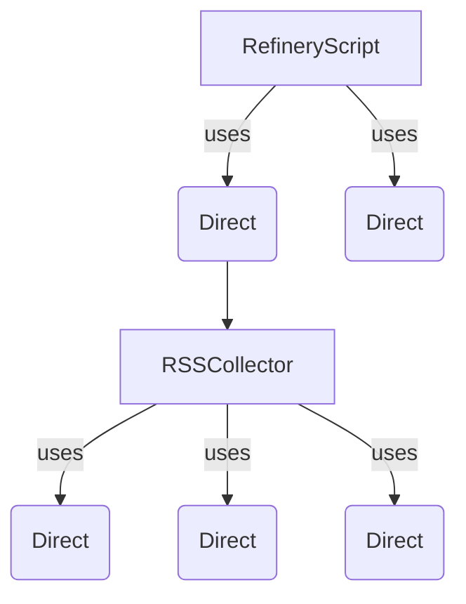
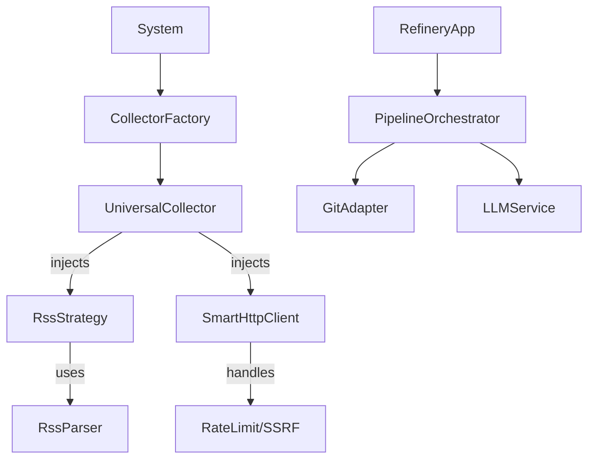

# Refactor Plan: Architecture Delta

## 1. Architectural Analysis (SOLID + Zen)

| Principle                | Violation Location                            | Why it hurts                                                                                                                          | Proposed Fix                                                                                                                               |
| :----------------------- | :-------------------------------------------- | :------------------------------------------------------------------------------------------------------------------------------------ | :----------------------------------------------------------------------------------------------------------------------------------------- |
| **SRP** (Single Resp)    | `RSSCollector.collect_from_source`            | **God Method**: Fetches HTTP, handles retry, parses XML, cleans HTML, validates tokens. Hard to test parsing without mocking network. | **Extract**: `RssParser` class. Collector only orchestrates: `client.fetch()` -> `parser.parse()` -> `cleaner.normalize()` -> `db.save()`. |
| **SRP**                  | `apps/refinery/main.py`                       | **God Script**: Mixes Git operations, DB cursor management, LLM orchestration, and file drafting.                                     | **Decouple**: Create `ArticleRefiner` service and `GitPublisher` adapter.                                                                  |
| **OCP** (Open/Closed)    | `CollectorDispatcher`                         | Adding a new collector requires modifying the dispatcher and maybe `system.py`.                                                       | **Registry**: Use a dynamic registry or plugin pattern for collectors.                                                                     |
| **LSP** (Liskov Subst)   | `AsyncRSSCollector` inherits `RSSCollector`   | **Fragile**: Overrides `collect_from_source` with async version but keeps sync methods that sleep.                                    | **Composition**: Both should inherit from abstract `BaseCollector` and use massive code sharing via `RssLogic` helper (or just kill Sync). |
| **DIP** (Dependency Inv) | Collectors depend on `httpx`/`requests`       | **Coupling**: Hard to swap HTTP libs or inject global rate limits/logging.                                                            | **Interface**: Inject `IHttpClient` (implementation: `SmartHttpClient`).                                                                   |
| **KISS**                 | `_process_article_html` vs `_process_article` | **Duplication**: Similar normalization logic copied in multiple files.                                                                | **Unify**: Shared `ArticleNormalizer` class.                                                                                               |

## 2. Architecture Delta

### Current State (Spaghetti/God Objects)

### Proposed State (Clean/Layered)

## 3. Refactor Sequence (Safe & Reversible)

### Step 1: Infrastructure Foundation (Low Risk)

- **Goal**: Fix critical HTTP bugs and unify clients.
- **Action**: Create `news_collector/infrastructure/http_client.py` with `SmartHttpClient`.
- **Benefit**: Solves blocking `time.sleep()`, unifies SSRF checks, centralizes timeouts.
- **Rollback**: Revert imports.

### Step 2: Extract Logic from Collectors (Medium Risk)

- **Goal**: SRP compliance. Testable parsing.
- **Action**: Create `news_collector/logic/parsers/rss_parser.py`. Move `_extract_articles_from_feed` logic there.
- **Benefit**: Can test feed parsing with local XML files, 0 network.
- **Rollback**: `RSSCollector` wraps new parser, can revert to internal method if needed.

### Step 3: Unify LLM Providers (Medium Risk)

- **Goal**: Fix Split Brain LLMs.
- **Action**: Create `news_collector/infrastructure/llm/provider.py`. Merge `utils/llm_client.py` and `ai_editor.py`.
- **Benefit**: Consistent timeouts, logging, and retry policies.

### Step 4: Refinery Pipeline (High Risk)

- **Goal**: Fix God Script.
- **Action**: Refactor `apps/refinery/main.py` into `RefineryEngine` class.
- **Benefit**: Testable publishing flow.

### Step 5: Async Native (Architecture Change)

- **Goal**: Fix LSP violation.
- **Action**: Deprecate `RSSCollector` (Sync). Promote `AsyncRSSCollector` to be the primary `RSSCollector`.
- **Benefit**: Simpler inheritance hierarchy.

## 4. Top 5 Fixes to Do This Week (Prioritized)

1.  **[Infra]** Implement `SmartHttpClient` (Fixes blocking sleep bug).
2.  **[Logic]** Extract `RssParser` (Enables unit testing).
3.  **[Refinery]** Class-ify `RefineryEngine` (Enables testing of publishing logic).
4.  **[Hygiene]** Replace `except: pass` with `logger.warning`.
5.  **[Config]** Unify strict timeout configurations.
