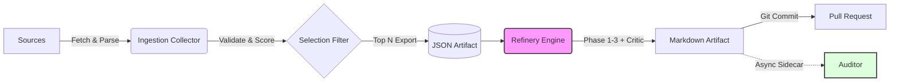

# Noticiencias — Pipeline Mapping & Diagram (Current State)

## 1. Executive Summary

The **Noticiencias** pipeline operates as a **dual-stage asynchronous system**:

1.  **Ingestion (Collector)**: Runs autonomously to fetch, validate, and score articles, exporting the top contenders to a JSON artifacts file.
2.  **Refinery (Editorial)**: A human-in-the-loop (Streamlit) or automated process that consumes the JSON export and transforms content through a 3-stage LLM pipeline (Translate $\rightarrow$ Adapt $\rightarrow$ Metadata).

**Crucially**, a hidden **Phase 2.5 "Critic"** acts as a fail-closed guardrail within the Refinery, rejecting content that violates scientific or linguistic integrity before it receives metadata. A separate **Auditor** sidecar runs asynchronously (non-blocking) to score published content for epistemic rigor, failing open to ensure publishing velocity.

---

## 2. Mermaid Diagram — High Level



---

## 3. Mermaid Diagram — Detailed

```mermaid
flowchart TD
    subgraph Ingestion ["Ingestion (Collector)"]
        S1[External Sources] -->|RSS/API| I1[Fetcher]
        I1 -->|Parse| I2[Normalizer]
        I2 --> I3{Validator}
        I3 -- Invalid --> I4[Reject & Log]
        I3 -- Valid --> I5[Scorer (Heuristic/Cognitive)]
        I5 --> I6[DB Storage]
        I6 --> I7[Exporter (Top N JSON)]
    end

    subgraph Refinery ["Refinery (Editorial Pipeline)"]
        I7 -->|Load| R1[Refinery Engine]
        R1 -->|Idempotency Check| R2{Exists?}
        R2 -- Yes --> R3[Skip / Update]
        R2 -- No --> P1[Phase 1: Translator]

        P1 --> P2[Phase 2: Editor Adapter]

        %% Phase 2.5 Critic
        P2 --> P25{Phase 2.5: Critic}
        P25 -- "Reject (Retry < 2)" --> Repair[Repair with Feedback]
        Repair --> P25
        P25 -- "Reject (Retry >= 2)" --> Fail[Fail Closed (Raise Error)]
        P25 -- "Pass (Score > 70)" --> P3[Phase 3: Headlines & XML]

        P3 --> P4[Deterministic Repair]
        P4 --> P5[Generate Frontmatter]
    end

    subgraph Publishing
        P5 --> Pub1[Write .md File]
        Pub1 --> Pub2[Update Manifest]
        Pub2 --> Pub3[Git Branch & Commit]
        Pub3 --> Pub4[Create PR]
    end

    subgraph Auditor ["Auditor (Sidecar)"]
        Pub1 -.->|Submit Async| A1{Trigger?}
        A1 -- "Keywords/Rand/Cat" --> A2[Circuit Breaker]
        A2 -- Open --> A3[Skip]
        A2 -- Closed --> A4[LLM Audit]
        A4 --> A5[Atomic JSON Write]
        A4 -- Error --> A6[Fail Open (Log & Trip Breaker)]
    end

    classDef critical fill:#ffcccc,stroke:#333,stroke-width:2px;
    classDef sidecar fill:#ccffcc,stroke:#333,stroke-dasharray: 5 5;
    class P25 critical;
    class Auditor sidecar;
    class A1,A2,A3,A4,A5,A6 sidecar;
```

---

## 4. ASCII Overview

```text
[ Sources ]
    |
    v
( Ingestion Loop ) -----------------------+
    | 1. Fetch                            |
    | 2. Normalize                        |
    | 3. Validate (Schema)                |
    | 4. Score (Heuristic)                v
    +------------------------> [ DB: raw_articles ]
                                          |
                                          v
                                [ JSON: latest_articles.json ]
                                          |
                                          v
[ Refinery UI / CLI ] <===================+
    |
    +--- Phase 1: Translator (Scientific -> Spanish)
    |
    +--- Phase 2: Editor (Style Adaptation)
    |
    +--- [ PHASE 2.5: CRITIC ] <---( Loop: Verify -> Reject -> Repair )
    |       |   (Fail Closed > 2 retries)
    |       |
    |       +---> Valid Content
    |
    +--- Phase 3: Metadata (Headlines, Tags, Excerpt)
    |
    v
[ Artifact Generation ]
    |
    +--> Write .md File  ----.
    |                        |
    +--> Git Commit/PR       : (Async Non-Blocking)
                             :.......> [ Auditor Sidecar ]
                                            |
                                            +-> Check Triggers
                                            +-> LLM Evaluation
                                            +-> Write auditor_score.json
```

---

## 5. Phase Inventory Table

| Phase ID   | Phase Name    | Purpose                | Inputs             | Outputs             | Failure Mode            | Visible in UI? | Configurable? | Code Location           |
| :--------- | :------------ | :--------------------- | :----------------- | :------------------ | :---------------------- | :------------- | :------------ | :---------------------- |
| **Ingest** | Collector     | Fetch & Normalize      | RSS/API            | DB Rows             | Fail-Soft (Skip Source) | No             | Yes (Weights) | `news_collector/system` |
| **P1**     | Translator    | Scientific Translation | Raw Text           | Cache `_stage1.txt` | Fail-Closed             | Yes (Model)    | Yes           | `ai_editor.py:307`      |
| **P2**     | Editor        | Style Adaptation       | Translated Text    | Cache `_stage2.txt` | Fail-Closed             | Yes (Model)    | Yes           | `ai_editor.py:320`      |
| **P2.5**   | **Critic**    | **Quality Guardrail**  | Adapted Text       | **Bool / Feedback** | **Fail-Closed**         | **No**         | **Indirect**  | `ai_editor.py:339`      |
| **Repair** | Feedback Loop | Fix Critic Rejections  | Feedback + P1 Text | Revised Text        | Fail-Closed             | No             | No            | `ai_editor.py:397`      |
| **P3**     | Metadata      | Headlines & Tags       | Final Text         | Dict (JSON)         | Fail-Closed             | Yes (Model)    | Yes           | `ai_editor.py:413`      |
| **Pub**    | Publisher     | File I/O & Git         | Final Artifacts    | `.md` File, PR      | Fail-Closed             | No             | No            | `refinery_engine.py`    |
| **Audit**  | Auditor       | Epistemic Review       | `.md` Content      | `score.json`        | **Fail-Open**           | No             | No            | `auditor.py`            |

---

## 6. Contracts & Artifacts

### 1. Ingestion Export

- **Format**: JSON
- **Schema**: `ExportContractV2` (List of Articles)
- **Location**: `data/exports/latest_articles.json`
- **Reader**: `apps/refinery/main.py`

### 2. Refinery Manifest

- **Format**: JSON (Key-Value map)
- **Content**: `{ "article_id": "filename.md" }`
- **Location**: `src/content/posts/refinery_manifest.json`
- **Purpose**: O(1) Idempotency lookup to avoid file system scans.

### 3. Published Article

- **Format**: Markdown + YAML Frontmatter
- **Schema**: `AstroPost` (Strict Pydantic validation)
- **Key Fields**: `refinery_id`, `schema_version: 2`, `headlines_variants`.

### 4. Auditor Score

- **Format**: JSON
- **Location**: `data/article_metadata/{slug_safe_id}/auditor_score.json`
- **Write Strategy**: Atomic write (temp file -> rename).

---

## 7. Reality vs GUI Mismatches

1.  **Hidden Critic Settings**: The Streamlit UI allows model selection for Phase 1, 2, and 3. **Phase 2.5 (Critic)** uses the **Editor Model** configuration but uses a distinct system prompt and logic path. Users cannot select a specific "Critic Model" in the UI.
2.  **Implicit Thresholds**: The Critic rejection threshold (`critic_score_threshold = 70`) is hardcoded in `ai_editor.py` (checked via `TEXT_PROCESSING_CONFIG` fallback) and **not exposed** in the UI.
3.  **Auditor Backpressure**: The UI shows "Refining..." but provides **no visibility** into the Auditor's background queue. If the Auditor is backlogged or tripping its circuit breaker, the user sees no indication.
4.  **Ingestion Controls**: The UI allows setting scoring weights, but the **Fast Mode** toggle (cognitive bypass) logic is partly in the UI and partly hardcoded in `run_refinery` calls.

---

## 8. Risk Map

### SPOFs (Single Points of Failure)

- **JSON Handoff**: The entire Refinery depends on `data/exports/latest_articles.json`. If this file is corrupted, locked, or deleted, the Refinery UI shows "No articles found" with no fallback to the DB (it tries a local sibling path, but that's a filesystem dependency).
  - _Mitigation_: The code attempts to load from `temp/source` (cloned) OR local sibling, but a DB-direct connection would be robust.

### Redundancies

- **Manifest vs. Scan**: `RefineryEngine` checks a `refinery_manifest.json` for existence. If missing, it falls back to a "Slow Scan" of the directory. This is a **good redundancy** (Self-Healing).
- **Category Logic**: Categories are mapped in `process_article` (hardcoded map) _and_ possibly in the Collector.

### Blind Spots

- **Auditor Visibility**: Results from the Auditor are written to disk (`auditor_score.json`) but **never read back** by the UI or the Publisher. If an article scores `0/100` on rigor, it is still published (Fail-Open), and the user is never notified.
- **Critic "Kill Switch"**: The `ENABLE_TRANSLATION_GUARD` env var is checked inside `_critic_pass`. If set to `false` in the environment (e.g., via Docker config), the entire safety layer is bypassed silently.

---

## 9. Questions for Maintainer

1.  **Critic Model decoupling**: Currently, Phase 2.5 uses `self.editor_model`. Should we expose a dedicated `critic_model` setting in the UI to allow using a smaller/faster model (e.g., Llama 3.2) for validation while keeping a larger model (Qwen) for editing?
2.  **Auditor Feedback Loop**: Auditor results are currently "write-only". Is the intention to eventually display these scores in the "Publicados" tab or use them to auto-flag PRs?
3.  **Threshold Exposure**: Should the Critic's acceptance threshold (70/100) be exposed in the "Calibration" tab of the UI?
4.  **Ingestion Handoff**: Why does Refinery rely on `json` exports rather than reading `pending` articles directly from the shared SQLite DB? (Suspect: Decoupling of environments?)
5.  **Fail-Closed/Open Strategy**: The Critic is Fail-Closed (good), but the Auditor is Fail-Open. Confirm this is the desired behavior for the "Epistemic Rigor" check?
6.  **Concurrency**: The Auditor uses a `ThreadPoolExecutor(max_workers=1)`. Is this sufficient if the Refinery processes a batch of 50 articles? The queue might grow large.
7.  **Legacy "Fast Mode"**: The UI has a checkbox for "Mode Cognitivo Active" which implies disabling it activates a fast mode. Verify if this legacy path is still fully supported/tested.
8.  **Prompt Management**: Prompts are loaded from `yaml`. If the YAML load fails, hardcoded fallbacks are used. Do we need a UI warning if fallbacks are active?
9.  **Image Handling**: Image download failures fallback to a default image. Should this be a warning in the PR body?
10. **Tag Normalization**: The `TagNormalizer` runs during Phase 3. If it modifies tags heavily, should this be flagged in the Frontmatter (e.g., `tags_modified: true`)?
