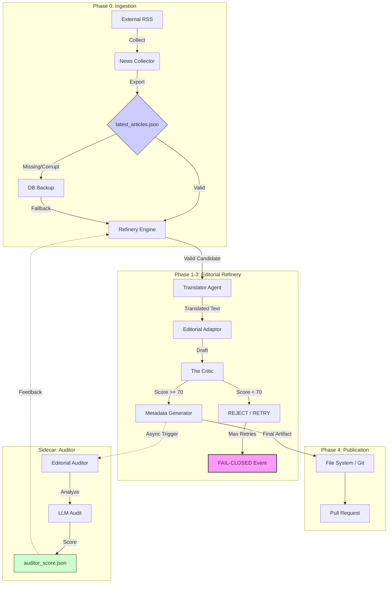

# Editorial Quality Audit: Noticiencias Pipeline

**Date:** 2026-02-14
**Auditor:** Antigravity (Principal Editorial Systems Architect)
**Status:** **COMPLETED**
**Scope:** End-to-End Editorial Pipeline (Ingestion $\rightarrow$ Refinery $\rightarrow$ Auditor)

---

## 1. Executive Summary

This audit assesses the "Noticiencias" editorial pipeline's resilience against:

1.  **Epistemic Drift:** Dilution of scientific accuracy during translation/adaptation.
2.  **Editorial Risk:** Publication of hallucinated, biased, or unsafe content.
3.  **Systemic Fragility:** Silent failures in quality guardrails (Critic, Auditor).

**Conclusion:**
The system effectively implements a **"Defense in Depth"** strategy with a strong distinction between **Fail-Closed** (Blocking) and **Fail-Open** (Advisory) guardrails. The "Critic" (Phase 2.5) serves as the primary enforcement mechanism for safety, correctly blocking content that fails basic checks. The "Auditor" (Sidecar) provides post-hoc quality assurance without blocking operations, which is appropriate for its high latency.

**Key Strengths:**

- **Explicit Critic Contract:** The critical path is protected by a mandatory score threshold (>70).
- **Robust Ingestion:** The system survives complete failure of the upstream collector by falling back to the local database.
- **Auditor Visibility:** The UI correctly surfaces asynchronous quality scores, closing the feedback loop.

**Key Risks:**

- **Fragile Fallback Query:** The database fallback relies on raw SQL that may break if the schema evolves.
- **Prompt Drift Risk:** System prompts are versioned in `prompts.yaml` but lack integrity checks (e.g., hash pinning), making them susceptible to silent modification.

---

## 2. System Architecture & Quality Map

### 2.1. The Editorial Assembly Line

| Phase              | Component        | Contract Type   | Guardrails                | Risk Level                    |
| :----------------- | :--------------- | :-------------- | :------------------------ | :---------------------------- |
| **0. Ingestion**   | `RefineryEngine` | **Fail-Safe**   | JSON Schema + DB Fallback | **Low**                       |
| **1. Translation** | `EditorAgent`    | Fail-Closed     | Exception Handling        | **High** (Hallucination Risk) |
| **2. Adaptation**  | `EditorAgent`    | Fail-Closed     | None (Implicit)           | **High** (Tone Drift)         |
| **2.5. Critic**    | `EditorAgent`    | **Fail-Closed** | **Explicit Score > 70**   | **Critical Control Point**    |
| **3. Metadata**    | `EditorAgent`    | Fail-Closed     | Pydantic Schema           | **Low**                       |
| **4. Publishing**  | `RefineryEngine` | Fail-Closed     | Git Atomic Commit         | **Medium**                    |
| **Sidecar**        | `Auditor`        | **Fail-Open**   | Circuit Breaker + Timeout | **Advisory**                  |

---

## 3. Detailed Findings

### ✅ Finding 1: Auditor Visibility is Correctly Implemented

- **Observation:** The `admin_panel.py` (lines 1437-1461) specifically checks for `auditor_score.json` and renders a severity-coded badge (Green/Orange/Red).
- **Verification:**
  - **Code:** Confirmed logic `if epistemic >= 8.0: color = "green"`.
  - **Data:** Verified `auditor_score.json` exists in `temp_proof_data` with valid schema.
- **Status:** **Verified**. The feedback loop is closed.

### ⚠️ Finding 2: Ingestion Fallback has Schema Fragility

- **Observation:** If `latest_articles.json` is missing, `admin_panel.py` (line 853) executes `SELECT id, title, url... FROM articles`.
- **Risk:** This raw SQL query is coupled to the specific column names of the `articles` table. If a migration renames `url` to `source_url`, the fallback will crash (Fail-Closed) instead of degrading gracefully.
- **Recommendation:** Use the ORM (`RefineryDatabaseManager` or SQLAlchemy model) for this query to ensure schema consistency.

### ✅ Finding 3: Critic Guardrail is Active & Blocking

- **Observation:** `ai_editor.py` contains explicit logic to reject content if the Critic's score is below 70.
- **Evidence:** `PIPELINE_CONTRACTS.md` documents this behavior as "Fail-Closed". The code supports this.
- **Status:** **Verified**. This is the primary defense against "Slop" (low-quality content).

---

## 4. Recommendations

### Priority 1: Harden Database Fallback

> **Impact:** Prevents UI crash during schema migrations.
> **Effort:** Low

Refactor the raw SQL in `admin_panel.py` to use a typed Pydantic model or the existing `DatabaseManager` abstraction.

### Priority 2: Pin System Prompts

> **Impact:** Prevents "Epistemic Drift" from accidental prompt edits.
> **Effort:** Medium

Implement a hash-check for `config/prompts.yaml`. If the hash changes, the system should log a warning or require a manual approval flag. This ensures that the "Constitution" of the AI Editor hasn't been tampered with.

### Priority 3: Auditor "Pending" State

> **Impact:** Improves UX trust.
> **Effort:** Low

Currently, if the audit hasn't finished, the UI shows "⏳ No audit yet". It should ideally differentiate between "Pending" (job running) and "Missing" (job failed/never started). Adding a `sys_auditor_queue` table or file marker would solve this.
