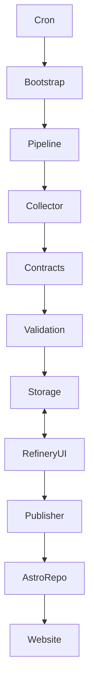

# Noticiencias System Architecture

Version: 2.2 (Aligned to AGENTS v2.4) Status: Active & Binding
Authority: Subservient to `SOURCE_OF_TRUTH.md` and `AGENTS.md`

---

# Purpose of This Document

This document explains **how** architectural law is implemented
technically.

If:

- `SOURCE_OF_TRUTH.md` defines constitutional principles
- `AGENTS.md` defines enforceable backend law (what is
  mandatory/forbidden)

Then this document defines the **engineering implementation model**
(diagrams, flows, and code-to-law mapping).

It must never contradict higher-authority documents.

---

# 1. Institutional Hierarchy

Order of authority:

1.  `SOURCE_OF_TRUTH.md` (Constitution)
2.  `AGENTS.md` (Backend Law)
3.  `ARCHITECTURE.md` (Implementation Model --- this document)
4.  `RUNBOOK.md` (Operational Procedures)
5.  Inline documentation

---

# 2. System Topology

The ecosystem is a Hybrid Monorepo separating inference logic from
presentation.

---

Component Role Tech Location

---

Brain Ingestion, NLP, Python 3.13+, `news_collector/`
(`news_collector`) Contracts, Pydantic,  
 Orchestration SQLAlchemy

Refinery Human-in-the-loop Streamlit, Ollama `apps/refinery/`
(`apps/refinery`) editorial system

Face Static publishing & Astro 5, Tailwind External repo
(`noticiencias`) SEO

---

Separation ensures presentation cannot mutate canonical backend
identity.

---

# 3. Global Data Flow (Deterministic Model)



Identity-critical paths must remain deterministic.

Non-determinism is allowed only in logging/telemetry layers.

---

# 4. Invariant Classification & Enforcement Mapping

This section maps constitutional/backend invariants to implementation.

## 4.1 Critical Invariants

### A. Canonical Identity Determinism

Implemented via:

- Canonical reuse scan in `RefineryEngine` (detect existing
  `refinery_id`)
- Upstream `published_date` binding (date must not come from runtime
  clock)
- Slug derivation independent of runtime and execution order
- Persist-once identity: first publication locks canonical artifacts
- Integration tests enforcing stability across reprocessing

Reprocessing must produce identical canonical artifacts.

#### A1. Canonical ID Protection Model (LAW-4A)

If `refinery_id` is algorithmically derived (hash/derivation), then the
**derivation algorithm is part of canonical identity**.

Implementation requirements:

- **Persisted identity wins:** once an artifact exists, `refinery_id`
  is read from the canonical source (repo/frontmatter/DB) and reused.
- **No retroactive rewrites:** code changes must not regenerate a
  different `refinery_id` for existing artifacts.
- **Versioned evolution:** if a new derivation is introduced, it must
  be versioned (e.g., `refinery_id_v2`) and applied only to new
  artifacts, while preserving existing IDs.

Minimum tests (examples of intent):

- "Existing artifact reprocessed after code change retains same
  `refinery_id`."
- "Two runs on same input yield identical canonical identity
  (including ID)."

> Note: If `refinery_id` is not derived (e.g., stored
> UUID/DB-generated), the protection still applies: generation point is
> fixed, and reprocessing must reuse the stored value.

---

### B. Contract-Driven Boundaries

Implemented via:

- Pydantic models in `news_collector/contracts/`
- Boundary methods accept/return contract types only
- Contract schema tests (shape + required fields)
- Adapter mapping tests (external → contract; domain → contract;
  contract → export)

No dict-based boundary crossing is allowed at sealed boundaries.

---

### B1. SourceRegistry Identity Boundary Model (LAW-1A)

Canonical source identity is governed by `source_id` and the registry
`news_collector.config.sources.ALL_SOURCES`.

Boundary behavior:

- For schema_version >= 2 payloads, `source_id` is mandatory.
- `source_name` is treated as display metadata and canonicalized from
  registry after `source_id` resolution.
- Registry source names must be casefold-unique for deterministic
  fallback behavior.
- Missing `source_id` in schema_version >= 2 fails at boundary
  validation before domain processing.

Legacy-only compatibility:

- Adapter fallback `source_name -> source_id` is available only for
  schema_version `1` compatibility path.
- Fallback uses casefold lookup against registry names and must remain
  deterministic.
- Non-legacy payloads must never use fallback.

---

### B2. Schema Version Governance Model (LAW-1A)

Ingress/export payload handling at adapter boundary:

- `schema_version: 1`: legacy path enabled, warning emitted.
- `schema_version: 2+`: strict path enabled; `source_id` required.
- Missing/invalid `schema_version`: treated as legacy compatibility path
  with warning.

Containment rule:

- Legacy branching is isolated to adapter/input-normalization boundary.
- Contract models, domain logic, and orchestration consume normalized
  shape only.

Deprecation governance:

- No hard cutoff date is currently approved.
- CI minimum enforcement until cutoff is approved:
  - test that legacy path emits warning and deterministic mapping.
  - test that non-legacy payloads without `source_id` fail hard.

---

### B3. Publication Provenance Model (LAW-1A)

Publication artifacts include `source_identity` metadata for audit
traceability.

- This metadata is auxiliary provenance, not canonical identity storage.
- Canonical identity remains contract-level `source_id` validated at
  boundary.
- Provenance persistence must be idempotent across reprocessing.

---

## 4.2 Structural Invariants

### A. System Layer Purity (Orchestration Only)

`news_collector/system/` is orchestration-only.

It may:

- Wire dependencies
- Control execution flow
- Emit semantic events

It may NOT:

- Apply business rules
- Shape contract payloads
- Serialize artifacts
- Embed scoring logic
- Implement validation rules

**Implementation pattern:** system orchestrates calls into
domain/components and adapters; it does not "prepare" payloads by
itself.

---

### B. Domain Purity & Dependency Direction (LAW-5)

The domain is the semantic core. Dependency direction is inward:

- `system/` depends on domain
- `contracts/` depends on domain (via adapters)
- domain depends on neither `system/` nor `contracts/`

Implementation model:

- Domain logic lives in `news_collector/components/` (or a dedicated
  `news_collector/domain/` if you split later).
- Domain defines "ports" (interfaces) where needed; outer layers
  implement them.
- Domain code must be unit-testable without DB/network/LLM.

Enforcement model (examples):

- Import-guard architecture test: fails if domain imports
  `news_collector.system.*` or `news_collector.contracts.*`
- Unit tests: validate domain rules without involving
  adapters/contracts.

---

### C. Observability Isolation (S1-C)

Logging/telemetry implemented in:

- `news_collector/system/observability.py`

Pipeline emits semantic events (e.g., `trace_cycle_start`,
`trace_item_processed`) rather than direct logging calls inside business
logic.

This prevents cross-contamination of business logic and observability.

---

## 4.3 Policy Invariants

### A. Coverage Protection

Tests must protect invariant-bearing paths:

- Contract logic
- Adapter mappings
- Identity path (slug/date/refinery_id persistence)
- Boundary methods

Numeric coverage is secondary to invariant protection.

---

### B. CI Enforcement

Pull Requests must be blocked if:

- Contract boundaries are broken
- Deterministic identity is compromised
- Canonical ID protection is violated
- Source identity strictness (`source_id` in schema_version >= 2) is
  weakened
- Non-legacy fallback identity mapping is introduced
- Protected tests are removed
- Invariant coverage is reduced

---

# 5. Directory Structure (Law-Aligned)

```text
noticiencias_news_collector/
├── news_collector/
│   ├── contracts/                 # Critical invariant: typed boundaries
│   │   ├── adapters/              # Exclusive transformation layer (package)
│   │   │   ├── __init__.py        # Stable adapter API
│   │   │   ├── validation.py
│   │   │   ├── scoring.py
│   │   │   └── export.py
│   ├── system/                    # Structural invariant: orchestration only
│   ├── collectors/                # External I/O (dirty inputs)
│   ├── components/                # Domain logic (semantic core)
│   ├── storage/                   # Persistence layer
│   └── utils/                     # Non-domain helpers (avoid leaking into domain)
│
├── apps/
│   └── refinery/
│
├── data/
├── scripts/
└── config.toml
```

---

# 6. Determinism Model

Determinism applies to:

- Slug generation
- Canonical filename
- Publication date binding
- Canonical ID (`refinery_id`) persistence / protection

Forbidden in identity path:

- `datetime.now()`
- Random generators
- Execution-order-dependent behavior

Allowed outside identity path:

- Logging timestamps
- Metrics sampling
- Telemetry counters

---

# 7. Contract Flow Model

External Input → Dirty Data
Dirty Data → Adapter Normalization
Adapter Normalization (legacy-only fallback + source canonicalization) →
Contract
Contract → Domain Logic
Domain Logic → Adapter → Contract
Contract → Storage or UI
UI → Adapter → Export Contract → Publisher

All transformations occur in the **adapters layer** (as a package), not
scattered across system/domain.

---

# 8. Refinery & GitOps Model

Publisher must:

- Clone target repo deterministically
- Detect existing `refinery_id`
- Reuse canonical identity if exists
- Derive date from upstream metadata (not runtime)
- Open PR atomically

Publisher must never regenerate identity on update.

---

# 9. Evolution Protocol

Architectural evolution must:

1.  Respect invariant classification
2.  Follow amendment review (per `AGENTS.md`)
3.  Preserve determinism guarantees
4.  Preserve contract boundaries
5.  Preserve domain purity dependency direction

Architecture is durable but evolvable.

---

End of `ARCHITECTURE.md` --- Version 2.2 (Aligned to AGENTS v2.4)
