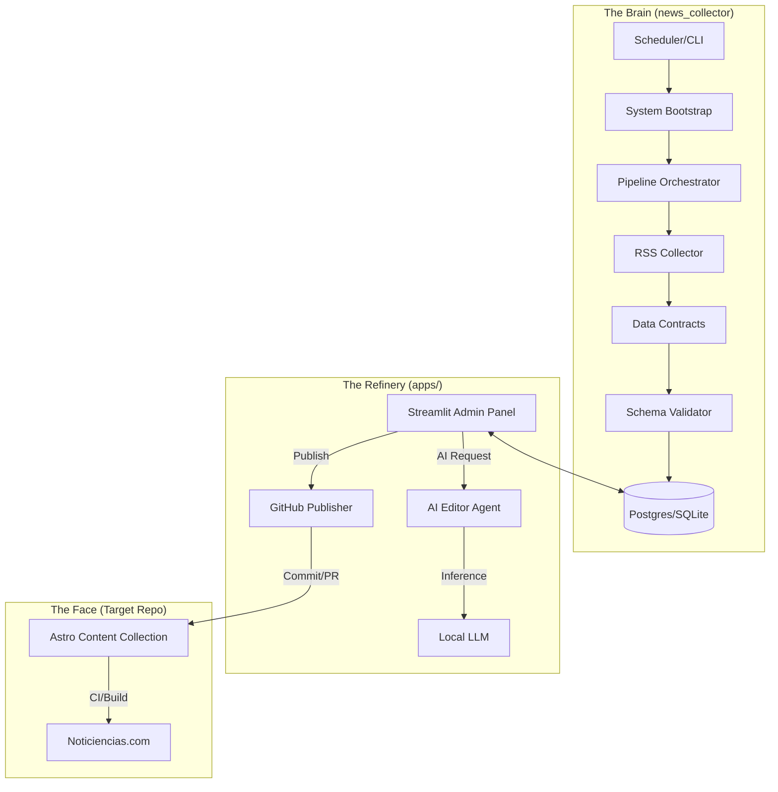

# Noticiencias System Architecture

> **Authority**: This document defines the technical structure of the Noticiencias ecosystem. It is subservient to [`SOURCE_OF_TRUTH.md`](SOURCE_OF_TRUTH.md) and [`AGENTS.md`](AGENTS.md).

## 1. High-Level Design

The Noticiencias architecture is a **Hybrid Monorepo** designed to decouple "Inference/Logic" (Backend) from "Presentation" (Frontend).

### Global Topology

| Component                      | Responsibility                             | Tech Stack                        | Location          |
| :----------------------------- | :----------------------------------------- | :-------------------------------- | :---------------- |
| **Brain (`news_collector`)**   | Ingestion, NLP, Scoring, Orchestration     | Python 3.13, Pydantic, SQLAlchemy | `news_collector/` |
| **Refinery (`apps/refinery`)** | Editorial UI, Human-in-the-Loop, AI Assist | Streamlit, Ollama                 | `apps/refinery/`  |
| **Face (`noticiencias`)**      | SEO, Static Rendering, Presentation        | Astro 5, Tailwind                 | _External Repo_   |

### Data Flow Diagram



---

## 2. Directory Structure (Current State)

The repository follows a strict modular design enforced by **Data Contracts**.

```text
noticiencias_news_collector/
├── news_collector/                # 📦 CORE LIBRARY
│   ├── contracts/                 # 🛡️ D1: Pydantic Models (The Law)
│   ├── system/                    # 🧠 S1: Orchestration & Bootstrap
│   │   ├── bootstrap.py           # Dependency Injection
│   │   ├── pipeline.py            # Execution Logic
│   │   └── observability.py       # S1-C: Logging/Metrics side-effects
│   ├── collectors/                # I/O: RSS Fetchers
│   ├── components/                # Agents: Editorial, Publishing
│   ├── storage/                   # DB Layer (SQLAlchemy)
│   └── utils/                     # Helpers
│
├── apps/                          # 🚀 APPLICATIONS
│   └── refinery/                  # Streamlit UI
│       ├── admin_panel.py         # Entry Point
│       └── main.py                # App Logic
│
├── data/                          # 💾 STATE
│   ├── news.db                    # SQLite Database
│   └── exports/                   # JSON Dumps
│
├── scripts/                       # 🛠️ OPS TOOLS
│   ├── audit_duplicates.py        # S2-B: Canonical Integrity Audit
│   └── verify_source.py           # Source Debugging
│
└── config.toml                    # ⚙️ CONFIGURATION
```

---

## 3. Core Subsystems & Boundaries

### 3.1 The Collector Engine

**Goal**: Deterministic ingestion of content.

- **Input**: RSS Feeds defined in `config.toml`.
- **Output**: Validated `CollectedArticle` objects.
- **Constraint**: Must respect `robots.txt` and rate limits.
- **Key Module**: `news_collector.system.pipeline`

### 3.2 The Refinery (Editorial)

**Goal**: Human-AI collaboration for quality control.

- **Input**: Raw candidates from DB.
- **AI Agent**: `EditorAgent` (uses Ollama).
  - **Stage 1**: Translation (EN -> ES).
  - **Stage 2**: Editorial Adaptation (Tone/Style).
  - **Stage 3**: Metadata/Frontmatter generation.
- **Output**: Markdown files with strictly typed Frontmatter.

### 3.3 The Publisher (GitOps)

**Goal**: Atomic content delivery.

- **Action**: Clones the Target Repo (Astro), creates a deterministic branch, and opens a PR.
- **Target**: `src/content/posts` in the Astro repository.

---

## 4. Architectural Invariants

These are hard constraints enforced by the system architecture.

### 4.1 Canonical Asset Integrity (S2-A)

> _Invariant: An article’s identity/URL must be stable and independent of processing time._

- **Problem**: Re-running the pipeline on a different date used to generate new URLs (duplicates).
- **Solution**: `RefineryEngine` scans the target repo for existing `refinery_id`.
  - **If Found**: Reuse existing filename/date strictly.
  - **If New**: Derive date from upstream `published_date`, NOT execution time.
  - **Enforcement**: `tests/integration/test_refinery_canonical.py`.

### 4.2 Data Contracts (D1)

> _Invariant: No data enters the system without passing Pydantic validation._

- All data moving between Collector, DB, and UI is encapsulated in models defined in `news_collector/contracts/`.
- **Adapters** (`adapters.py`) mediate between dirty external data and clean internal contracts.

### 4.3 Observability Separation (S1-C)

> _Invariant: Business log (Pipeline) must not be polluted by logging logic._

- All execution traces, metrics, and structured logs are delegated to `news_collector.system.observability`.
- The pipeline issues semantic events (`trace_cycle_start`, `trace_item_processed`) rather than raw log calls.

---

## 5. Operations & Verification

### 5.1 Verification Gates

Code quality is enforced via Makefiles.

- **`make test`**: Runs unit tests.
- **`make test-system`**: Runs integration/system tests (Gate for S1).
- **`make lint`**: Enforces Ruff/Format standards.

### 5.2 Manual Audits

Specific scripts exist for architectural audits:

- **Duplicate Check**: `python scripts/audit_duplicates.py`
  - Ensures no two files share the same `refinery_id`.

### 5.3 Deployment

- **Backend**: Dockerized or running as system service.
- **Frontend**: Built via GitHub Actions on the Target Repo.

---

_Last Updated: 2026-01-25 (Milestone S2-B/D1)_
