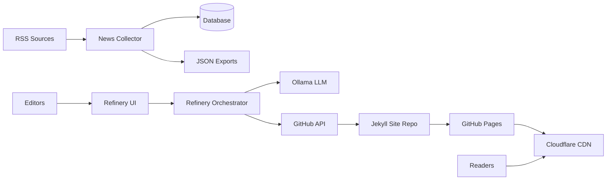

# A-1 Architecture and System Context Pack
Last updated: 2026-01-02

## Scope
This context pack covers two repos:
- c:\Users\corte\VS Code Projects\noticiencias_news_collector
- c:\Users\corte\VS Code Projects\noticiencias

Primary sources:
- c:\Users\corte\VS Code Projects\noticiencias_news_collector\README.md
- c:\Users\corte\VS Code Projects\noticiencias_news_collector\ARCHITECTURE.md
- c:\Users\corte\VS Code Projects\noticiencias_news_collector\run_collector.py
- c:\Users\corte\VS Code Projects\noticiencias_news_collector\apps\refinery\main.py
- c:\Users\corte\VS Code Projects\noticiencias_news_collector\apps\refinery\admin_panel.py
- c:\Users\corte\VS Code Projects\noticiencias\README.md

## C4 context diagram (system view)


## C4 container diagram (repo-level view)
```mermaid
flowchart TB
    subgraph Repo1[noticiencias_news_collector]
        CollectorCLI[run_collector.py CLI]
        CorePkg[news_collector package]
        DB[(SQLite/Postgres)]
        Exports[data/exports/latest_articles.json]
        RefineryUI[apps/refinery/admin_panel.py]
        RefineryOrch[apps/refinery/main.py]
        Config[config.toml + .env]
    end

    subgraph Repo2[noticiencias (Jekyll site)]
        Posts[_posts/*.md]
        SiteConfig[_config.yml]
        JekyllBuild[Jekyll build]
    end

    RSS[RSS sources] --> CollectorCLI
    CollectorCLI --> CorePkg
    CorePkg --> DB
    CorePkg --> Exports
    RefineryUI --> RefineryOrch
    RefineryOrch --> Exports
    RefineryOrch --> Ollama[Ollama LLM]
    RefineryOrch --> GitHubAPI[GitHub API]
    GitHubAPI --> Posts
    Posts --> JekyllBuild
    JekyllBuild --> GitHubPages[GitHub Pages]
    GitHubPages --> Cloudflare[Cloudflare CDN]
```

## Runtime topology (components)
| Component | Repo/Path | Entry point | Runtime | Data stores | Config/env | External deps |
|---|---|---|---|---|---|---|
| Collector CLI | noticiencias_news_collector | run_collector.py | Python 3.13+ | SQLite/Postgres | config.toml, .env | RSS sources |
| Core collector pipeline | noticiencias_news_collector/news_collector | main.py (create_system) | Python 3.13+ | SQLite/Postgres | config.toml | RSS, robots.txt |
| Export artifacts | noticiencias_news_collector/data/exports | latest_articles.json | N/A | filesystem | paths.data_dir | N/A |
| Refinery UI | noticiencias_news_collector/apps/refinery | admin_panel.py | Streamlit | refinery.db | .env | Ollama, GitHub API |
| Refinery orchestrator | noticiencias_news_collector/apps/refinery | main.py | Python 3.13+ | refinery.db | .env | Ollama, GitHub API |
| Jekyll site | noticiencias | Jekyll build | Ruby/Jekyll | _posts | _config.yml | GitHub Pages, Cloudflare |

## Trust boundaries and data classification
### Trust boundaries
- External input: RSS feeds and linked articles (untrusted).
- LLM boundary: Ollama output is untrusted and must be validated for formatting and content rules.
- GitHub API boundary: repo write access via token.
- Public site boundary: rendered content is public and indexed.

### Data classification
| Data type | Sensitivity | Storage | Notes |
|---|---|---|---|
| Article content/metadata | Public | DB + JSON export + site | Source URLs should be preserved |
| LLM prompts/outputs | Internal | logs/files | Avoid leaking tokens in logs |
| Access tokens and API keys | Secret | .env | GitHub token, analytics, DeepL |
| Reader analytics | Potential PII | GA4/Mailchimp | Treat as sensitive in logs |

## Critical invariants (must not break)
1) Respect robots.txt and rate limits during collection (config rules).
2) No duplicate or reprocessed articles without explicit user intent.
3) Export JSON represents latest, deduped candidate set.
4) Refinery output must include valid frontmatter and stable slug/date.
5) PR creation must be idempotent or safely retryable.
6) Published content must include source link attribution when available.

## Critical journeys (sampling anchor)
### noticiencias_news_collector
1) Collector run: RSS fetch -> enrichment -> scoring -> persist -> data/exports/latest_articles.json
2) Refinery publish: admin selects article -> LLM refinement -> write _posts -> PR creation

### noticiencias (site)
1) PR merge -> Jekyll build -> deploy -> live page render
2) Frontmatter/slug/date -> archive/category/tag pages render correctly

## Glossary
- Article: normalized item from RSS or ingestion.
- Collector: pipeline that fetches, enriches, scores, and stores items.
- Export: JSON file of latest candidate articles.
- Refinery: human-in-the-loop workflow that refines and publishes content.
- Scoring: multi-factor ranking of articles.
- Source: RSS feed or publication origin.
- Jekyll: static site generator used by the site repo.
- Frontmatter: YAML metadata block at top of a markdown post.

## Handoff notes to other audits
- A2 uses trust boundaries, secrets inventory, admin paths (Refinery UI).
- A6 uses runtime topology and config/env inventory.
- A1 uses critical invariants and journeys for correctness review.
